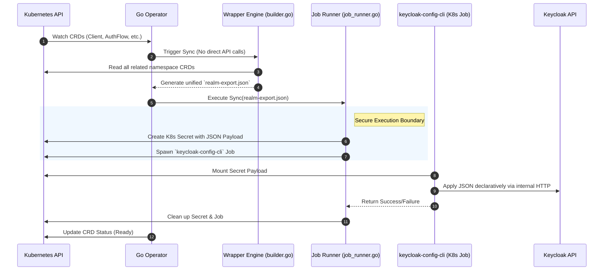

# Architecture

This document describes the Keycloak-specific architecture within the OCM/KRO ecosystem. For the general OCM packaging and KRO instantiation patterns shared across the project family, refer to the central platform documentation.

## Overview

The Keycloak OCM component bundles everything needed to deploy and operate one or more isolated Keycloak instances on Kubernetes -- including the identity server itself, its database backend, and the configuration layer. A single OCM component archive is the unit of distribution, transfer, and deployment.

```text
OCM Component
├── Container Images
│   ├── Keycloak
│   ├── PostgreSQL
│   └── Keycloak Operator
├── Helm Charts
│   └── keycloak-operator
├── KRO ResourceGraphDefinition
├── Kubernetes Manifests
└── Documentation
```

## Multi-Instance Model

Each Keycloak instance runs in its own administrator-controlled Kubernetes namespace (for example via `spec.namespace` in `KeycloakInstance`). This namespace-per-instance approach provides strong isolation without requiring separate clusters.

```text
Cluster
├── identity-site-1/        # Instance "site-1"
│   ├── PostgreSQL (CNPG)
│   ├── Keycloak
│   └── Client Operator
├── identity-site-2/        # Instance "site-2"
│   ├── PostgreSQL (CNPG)
│   ├── Keycloak
│   └── Client Operator
└── cnpg-system/            # CloudNativePG operator (cluster-wide, installed once)
```

Isolation boundaries per namespace:

- **Data** -- dedicated PostgreSQL cluster, no shared database
- **Configuration** -- namespace-scoped CRDs, independent realms and clients
- **Network** -- prepared default-deny NetworkPolicies (enforcement planned)
- **Access** -- RBAC scoped to the instance namespace
- **Resources** -- per-namespace quotas (planned)

Lifecycle is straightforward: deleting the namespace removes the entire instance cleanly.

## KRO Instantiation

A `KeycloakInstance` custom resource triggers KRO to create the namespace and all contained resources. The KRO ResourceGraphDefinition (RGD) encodes the dependency graph so that resources are created in the correct order.

```yaml
apiVersion: kro.run/v1alpha1
kind: KeycloakInstance
metadata:
  name: site-1
spec:
  namespace: identity-site-1
  # KRO creates this namespace and deploys all resources into it
```

## Startup Sequence

The deployment uses init containers and readiness checks to guarantee correct startup order and avoid crash loops:

```text
1. CloudNativePG operator ready (cluster-wide, prerequisite)
2. PostgreSQL Cluster created (CNPG CR in instance namespace)
3. Primary pod reaches Ready state (label: cnpg.io/instanceRole=primary)
4. Keycloak Deployment applied
5. Init container wait-for-db confirms port 5432 is reachable
6. Keycloak main container starts
```

## Declarative Configuration

Keycloak configuration (realms, clients, users, roles) is managed declaratively through Kubernetes Custom Resources. The CRD hierarchy follows the Keycloak domain model:

```text
KeycloakInstance (via KRO)
└── Realm
    ├── Client
    ├── User
    ├── Group
    └── ClientScope
```

All configuration CRDs are namespace-scoped, aligning with the multi-instance isolation model. This enables standard GitOps workflows with tools like ArgoCD or Flux.

See [USAGE.md](USAGE.md) for usage details and examples, and [CLIENT.md](CLIENT.md) for the implementation strategy and decision record.

## High Availability & Scalability

Both Keycloak and the PostgreSQL backend support multi-replica deployments for production use.

### Keycloak Replicas

The replica count is controlled via the `KeycloakInstance` CR (KRO path) or the `replicas` field in the Keycloak Deployment:

```yaml
# KeycloakInstance CR
spec:
  replicas: 3   # 3 Keycloak pods
```

The Deployment is configured with `maxUnavailable: 0` and `maxSurge: 1` — a new pod must pass the readiness probe on management port 9000 before any old pod is terminated, ensuring zero dropped requests during restarts.

A `PodDisruptionBudget` with `minAvailable: 1` prevents Kubernetes from evicting all Keycloak pods simultaneously during node drains or cluster maintenance.

#### Cluster Session Sharing

With `replicas > 1`, Keycloak activates Infinispan distributed caching (`KC_CACHE_STACK=kubernetes`) so that sessions created on one pod are valid on all others. This uses the Kubernetes JGroups KUBE_PING discovery protocol, which requires Keycloak pods to be able to list pods in their namespace. A dedicated `ServiceAccount` (`keycloak`) with a namespace-scoped `Role` and `RoleBinding` provides this access.

### PostgreSQL HA

CloudNativePG manages streaming replication between PostgreSQL instances automatically. The `dbInstances` field in the `KeycloakInstance` CR controls the cluster size:

```yaml
spec:
  dbInstances: 3   # primary + 2 standbys
```

The `keycloak-db-rw` service always points to the current primary. CNPG performs automatic failover if the primary fails.

## Backup Architecture Boundary (Runtime vs CI Harness)

Backup/restore follows a strict separation to keep the runtime control plane minimal and maintainable:

1. Runtime/API surface: CNPG-native resources only (`Backup`, `ScheduledBackup`, `ObjectStore`, recovery `Cluster`).
2. CI test harness: helper scripts prepare credentials/provider plumbing for live smoke tests.

This means the project intentionally does not reintroduce a custom Keycloak backup CRD/controller/reconciler. The additional script LOC is test orchestration logic, not product runtime logic.

Why this is aligned with OSS/industry practice:

1. Prefer first-party database operator APIs for backup lifecycle and restore semantics.
2. Keep operator API surface small to reduce long-term compatibility burden.
3. Keep environment-specific test setup (e.g., ephemeral in-cluster MinIO) outside runtime controllers.
4. Preserve portability for air-gapped environments by validating both external S3-compatible targets and CI-local fallback mode.

### Operator Instance Scoping (Air-Gapped / Zero Trust)

In high-security, defense-grade environments such as Open Defense Cloud, the operator runs strictly under a **One-Operator-per-Instance (Namespace-Scoped)** paradigm.

The operator is deployed per-instance inside the target namespace and restricts its `controller-runtime` watchers via the `WATCH_NAMESPACE` environment variable. 

**Blast Radius Protection:** This model naturally enforces Zero Trust between tenants. By binding the operator via namespace-local `RoleBindings` instead of `ClusterRoleBindings`, a compromised operator in Tenant A physically lacks the Kubernetes API permissions to read Keycloak secrets, CRDs, or Database credentials in Tenant B. This prevents lateral movement across the cluster and is the definitive standard for multi-tenant air-gapped clusters.

## Go Wrapper Architecture (keycloak-config-cli)

To achieve maximum security and feature compatibility, the Operator employs a **Hybrid Wrapper Architecture** instead of communicating directly with the Keycloak REST API. The Go Operator functions exclusively as the Kubernetes orchestration engine, while delegating the actual Keycloak configuration logic to the industry-standard `keycloak-config-cli` tool.



### Federated Controller Pattern

Unlike a monolithic "Sync Engine" that watches all resources at once, the operator uses a **Federated Pattern (one controller per resource type)**. This design is a deliberate choice for Open Defense Cloud to satisfy three critical requirements:

1.  **Strict Finalizers (Audit-Proof Deletions):** In air-gapped or high-security environments, resource deletion must be guaranteed. By having a dedicated `Client` controller, the Kubernetes object is protected by a finalizer that is *only* removed once the `realm_controller` confirms the `keycloak-config-cli` job has successfully purged the client from the server.
2.  **Shift-Left Error Visibility:** In older monolithic architectures, missing required fields often fail deep inside the execution job. By mapping our domain onto federated K8s structs adorned with `+kubebuilder:validation:Required` markers, malformed configurations (e.g., empty Client IDs) are strictly rejected by the Kubernetes API Server at the `kubectl apply` stage. This enforces defensive GitOps right at the PR validation step.
3.  **Cross-Namespace Safety & Efficiency:** The federated approach allows each controller to independently evaluate its `spec.realmRef`, triggering only the specific Realm instance required. This prevents the "O(n^2) watch problem" where a single controller would have to rebuild the entire cluster's dependency graph on every minor user update.

---

## OCM Packaging

The entire solution ships as a single OCM component containing all container images, Helm charts, manifests, and the KRO RGD. This enables:

- **Air-gapped deployment** -- all artifacts are bundled, no external registry access required at deploy time
- **Reproducibility** -- pinned versions for every dependency
- **Transfer** -- `ocm transfer` moves the component between registries
- **Signing** -- component integrity verified via `ocm sign`

## Decision Record

### OCM Packaging Strategy

*Decision: Package the Keycloak solution as a single OCM component containing all dependencies.*

The OCM standard is a project-wide requirement for air-gapped deployment. Bundling everything into one component -- container images, Helm charts, KRO RGD, manifests, and documentation -- gives a single deployable unit that can be transferred between registries, version-tracked, and validated as a whole. The alternative of splitting into multiple OCM components was rejected because it adds coordination overhead without meaningful benefit for a solution of this size.

Component structure:

```text
component-constructor.yaml
├── keycloak-image (ociImage)
├── postgres-image (ociImage)
├── operator-image (ociImage)
├── operator-chart (helmChart)
├── keycloak-instance-rgd (blueprint)
├── manifests (directory)
└── docs (directory)
```

### Multi-Instance Isolation via Namespaces

*Decision: Use Kubernetes namespaces as the primary isolation boundary, one namespace per KeycloakInstance.*

Namespaces are the natural Kubernetes-native isolation mechanism. They provide RBAC scoping, NetworkPolicy boundaries, and resource quotas without additional tooling. The namespace-per-instance model keeps the mental model simple and makes cleanup trivial (delete the namespace). The trade-off is a potentially large number of namespaces in clusters with many instances, but this is well within Kubernetes operational limits.

## Related Documents

| Topic | Document |
|-------|----------|
| PostgreSQL with CloudNativePG | [DATABASE.md](DATABASE.md) |
| Operator usage guide | [USAGE.md](USAGE.md) |
| Operator strategy & ADR | [CLIENT.md](CLIENT.md) |
| CI/CD pipeline | [CICD.md](CICD.md) |
