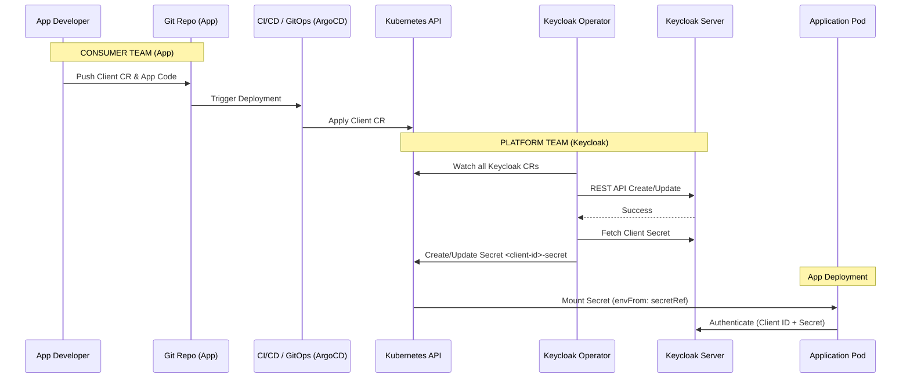

# Keycloak Operator: Usage Guide

## Overview

The Keycloak Operator enables a **declarative, Kubernetes-native approach** to managing Keycloak configuration. Instead of manual changes via the Keycloak Admin Console, teams define their requirements as Kubernetes Custom Resources (CRDs) and commit them to Git, enabling a full **GitOps workflow**.

The operator covers the full Keycloak resource hierarchy:

```text
KeycloakInstance (via KRO)
├── Realm
│   ├── Client              (realmRef required)
│   ├── ClientScope         (realmRef required)
│   ├── Group               (realmRef required)
│   ├── User                (realmRef required)
│   ├── IdentityProvider    (realmRef required)
│   └── AuthFlow            (realmRef required)

CNPG-native Day-2 resources (database scope)
├── Backup
└── ScheduledBackup
```

All resources are **namespace-scoped** and must be applied to the namespace of their target Keycloak instance (e.g. `keycloak-dev`). The operator reconciles them in dependency order every cycle:

1. Realms (Must be applied first)
2. ClientScopes
3. Individual AuthFlows (MFA Toggles)
4. Identity Providers
5. Groups
6. Clients
7. Users (group memberships resolved after groups are synced)

---

## GitOps Workflow

The typical flow for an application team consuming a Keycloak client:



---

## Realm

Realms are the top-level container for all other resources.

> [!IMPORTANT]
> **Federated Anchor:** You MUST create a `Realm` before applying any clients, scopes, groups, or users that reference it. Child resources without a valid `realmRef` (or missing the referenced Realm object) will fail to synchronize.

```yaml
apiVersion: keycloak.opendefense.cloud/v1alpha1
kind: Realm
metadata:
  name: tenant-a
  namespace: keycloak-dev
spec:
  realmName: tenant-a          # Keycloak realm ID — immutable after creation
  displayName: "Tenant A"
  enabled: true
  registrationAllowed: false
  resetPasswordAllowed: true
  bruteForceProtected: true
  accessTokenLifespan: 300     # seconds
```

```bash
kubectl apply -f realm.yaml
kubectl get Realms -n keycloak-dev
# NAME       REALMNAME   ENABLED   READY   AGE
# tenant-a   tenant-a    true      true    30s
```

> `realmName` is the Keycloak realm ID used as the identifier in all API calls. Do not change it after creation — the operator will attempt to create a second realm rather than rename the existing one.

> Deleting a `Realm` CR does **not** delete the realm from Keycloak — the realm is intentionally preserved to protect existing users and sessions. Remove it manually via the Keycloak Admin Console if needed.

> Deleting any other CR type (`Client`, `Group`, `User`, `ClientScope`) **does** remove the corresponding resource from Keycloak. The operator uses Kubernetes finalizers to propagate the deletion before the CR is garbage-collected.

---

## ClientScope

```yaml
apiVersion: keycloak.opendefense.cloud/v1alpha1
kind: ClientScope
metadata:
  name: tenant-a-profile
  namespace: keycloak-dev
spec:
  realmRef: tenant-a
  name: profile
  protocol: openid-connect
  description: "Standard profile scope exposing name and email claims"
  attributes:
    include.in.token.scope: "true"
    display.on.consent.screen: "true"
    consent.screen.text: "Access your profile information"
```

```bash
kubectl get ClientScopes -n keycloak-dev
# NAME                REALM      SCOPENAME   PROTOCOL        READY
# tenant-a-profile    tenant-a   profile     openid-connect  true
```

---

## Group

```yaml
apiVersion: keycloak.opendefense.cloud/v1alpha1
kind: Group
metadata:
  name: tenant-a-developers
  namespace: keycloak-dev
spec:
  realmRef: tenant-a
  name: developers
  attributes:
    department:
      - engineering
  realmRoles:
    - developer
```

```bash
kubectl get Groups -n keycloak-dev
# NAME                   REALM      GROUPNAME    READY
# tenant-a-developers    tenant-a   developers   true
```

---

## Client

Clients are the most frequently changing resource — every application deployment may add or update one. The operator creates a Kubernetes Secret with the client credentials, ready to be mounted into the application pod.

```yaml
apiVersion: keycloak.opendefense.cloud/v1alpha1
kind: Client
metadata:
  name: odc-showcase-client
  namespace: keycloak-dev
spec:
  realmRef: tenant-a           # defaults to "master" if omitted
  clientId: odc-showcase-client
  enabled: true
  redirectUris:
    - "https://showcase.example.com/*"
  webOrigins:
    - "https://showcase.example.com"
```

The operator automatically creates a secret named `<spec.clientId>-secret` (e.g. `odc-showcase-client-secret`) containing `CLIENT_ID` and `CLIENT_SECRET`. Mount it in your application:

```yaml
env:
  - name: OIDC_CLIENT_ID
    valueFrom:
      secretKeyRef:
        name: my-app-secret
        key: CLIENT_ID
  - name: OIDC_CLIENT_SECRET
    valueFrom:
      secretKeyRef:
        name: my-app-secret
        key: CLIENT_SECRET
```

```bash
kubectl get Clients -n keycloak-dev
# NAME                  REALM      CLIENTID               PROTOCOL        READY   AGE
# odc-showcase-client   tenant-a   odc-showcase-client    openid-connect  true    2m
```

---

## User

```yaml
apiVersion: keycloak.opendefense.cloud/v1alpha1
kind: User
metadata:
  name: jane-doe
  namespace: keycloak-dev
spec:
  realmRef: tenant-a
  username: jane.doe
  email: jane.doe@example.com
  firstName: Jane
  lastName: Doe
  enabled: true
  emailVerified: false
  groups:
    - developers            # resolved to group ID at sync time
  initialPassword:
    secretName: jane-doe-initial-password
    secretKey: password     # default key name
```

Create the initial password Secret before applying the user CR:

```bash
kubectl create secret generic jane-doe-initial-password \
  --namespace keycloak-dev \
  --from-literal=password=ChangeMeNow!
```

```bash
kubectl get Users -n keycloak-dev
# NAME       REALM      USERNAME    EMAIL                    READY
# jane-doe   tenant-a   jane.doe    jane.doe@example.com     true
```

> `initialPassword` is written **only on user creation**. Changing the secret or spec after creation does not reset the Keycloak password — use the Admin Console or API for subsequent changes.

> Group membership is synced every reconciliation cycle. Adding a group to `spec.groups` adds the user to it on the next cycle.

---

## AuthFlow

Auth flows define custom login behavior in Keycloak (for example browser flow with MFA requirement). In this operator, the model is intentionally opinionated and toggle-based to reduce misconfiguration risk.

```yaml
apiVersion: keycloak.opendefense.cloud/v1alpha1
kind: AuthFlow
metadata:
  name: hardened-browser-flow
  namespace: keycloak-dev
spec:
  realmRef: tenant-a
  alias: "Hardened Browser Flow"
  description: "Browser flow requiring MFA"
  topLevel: true
  
  # Defense Profile Toggles
  requireMFA: true        # Enforces OTP (Google Authenticator / FreeOTP)
```

```bash
kubectl get AuthFlows -n keycloak-dev
# NAME                    REALM      ALIAS                  READY
# hardened-browser-flow   tenant-a   Hardened Browser Flow  true
```

### Spec Fields

| Field | Type | Required | Description |
|---|---|---|---|
| `realmRef` | string | Yes | Target realm reference. |
| `alias` | string | Yes | Flow alias in Keycloak (must be unique in the realm). |
| `description` | string | No | Human-readable flow purpose. |
| `topLevel` | boolean | No | Marks this as a top-level flow. |
| `requireMFA` | boolean | No | If `true`, enforces OTP in the generated flow. |

If `realmRef` is omitted, the controller falls back to `master` during reconciliation.

`requireMFA: true` adds OTP as required execution in the generated flow. With `false`, the flow stays username/password only.

## IdentityProvider

Identity providers connect an external IdP (OIDC/SAML) to a realm. The operator creates, updates, and deletes the IdP definition in Keycloak.

```yaml
apiVersion: keycloak.opendefense.cloud/v1alpha1
kind: IdentityProvider
metadata:
  name: tenant-a-oidc-provider
  namespace: keycloak-dev
spec:
  realmRef: tenant-a
  alias: tenant-a-oidc
  type: oidc
  enabled: true
  displayName: "Tenant A Corporate OIDC"
  trustEmail: true
  config:
    authorizationUrl: "https://idp.corp.example.com/auth"
    tokenUrl: "https://idp.corp.example.com/token"
    clientId: "tenant-a-keycloak-client"
    defaultScope: "openid profile email"
```

### Spec Fields

| Field | Type | Required | Description |
|---|---|---|---|
| `realmRef` | string | Yes | Target realm reference. |
| `alias` | string | Yes | Unique IdP alias inside the realm. |
| `type` | string | Yes | Protocol type: `oidc` or `saml`. |
| `enabled` | boolean | No | Whether the IdP is active. |
| `displayName` | string | No | Human-readable label shown on login pages. |
| `storeToken` | boolean | No | Stores brokered tokens in Keycloak. |
| `addReadTokenRoleOnCreate` | boolean | No | Adds read-token role on IdP creation. |
| `trustEmail` | boolean | No | Trusts email from upstream IdP without re-verification. |
| `linkOnly` | boolean | No | Allows linking only (no login button usage). |
| `firstBrokerLoginFlowAlias` | string | No | First-login broker flow alias. |
| `postBrokerLoginFlowAlias` | string | No | Post-login broker flow alias. |
| `config` | map[string]string | No | Provider-specific settings (for example endpoints and clientId). |
| `clientSecretRef.name` | string | Conditional | Secret name for OIDC client secret. |
| `clientSecretRef.key` | string | Conditional | Secret key for OIDC client secret value. |
| `signingCertificateRef.name` | string | Conditional | Secret name for SAML signing certificate. |
| `signingCertificateRef.key` | string | Conditional | Secret key for SAML signing certificate PEM. |

If `realmRef` is omitted, the controller falls back to `master` during reconciliation.

For OIDC, keep endpoint and client metadata in `spec.config` (for example `authorizationUrl`, `tokenUrl`, `clientId`, `defaultScope`) and place the sensitive `clientSecret` in `clientSecretRef`.

For SAML, keep protocol options in `spec.config` and provide certificate material via `signingCertificateRef`.

```bash
kubectl get IdentityProviders -n keycloak-dev
# NAME                     REALM      ALIAS            READY
# tenant-a-oidc-provider   tenant-a   tenant-a-oidc    true
```

---

## Backup and Restore (CNPG-native)

Database backup and restore are handled directly via CloudNativePG resources.
This keeps the Keycloak operator lightweight and avoids custom backup and restore controllers.

```yaml
apiVersion: postgresql.cnpg.io/v1
kind: Backup
metadata:
  name: pre-upgrade-backup
  namespace: keycloak-dev
spec:
  cluster:
    name: keycloak-db
  method: plugin
  pluginConfiguration:
    name: barman-cloud.cloudnative-pg.io
```

```bash
kubectl get backups.postgresql.cnpg.io -n keycloak-dev
# NAME                PHASE       READY   AGE
# pre-upgrade-backup  completed   true    5m
```

Restore is performed by applying a recovery CNPG `Cluster` manifest and then
cutting Keycloak over to the restored cluster host. See [UPGRADE.md](UPGRADE.md)
and [examples/restore-cluster-example.yaml](../examples/restore-cluster-example.yaml).

---

## CR Status and Conditions

Every resource managed by the operator exposes a `status` subresource updated on every reconciliation pass. The standard fields are:

| Field | Type | Description |
|---|---|---|
| `status.ready` | boolean | `true` when the resource is in sync with Keycloak |
| `status.keycloakId` | string | The Keycloak-internal UUID of the managed object |
| `status.message` | string | Human-readable summary of the last operation or error |
| `status.lastSyncTime` | string (RFC3339) | Timestamp of the last reconciliation attempt |
| `status.conditions` | array | Kubernetes-standard condition entries |

The `conditions` array contains a single `Ready` condition whose `status` is `"True"` on success and `"False"` on any failure, with a descriptive `reason` and `message`:

```bash
kubectl get Clients -n keycloak-dev -o wide
# NAME     REALM      CLIENTID   PROTOCOL        READY   AGE
# my-app   tenant-a   my-app     openid-connect  true    2m

kubectl describe Client my-app -n keycloak-dev
# Status:
#   Conditions:
#     Last Transition Time:  2026-03-04T10:00:00Z
#     Message:               Synced successfully
#     Reason:                Synced
#     Status:                True
#     Type:                  Ready
#   Keycloak Id:             b3f2c1d4-...
#   Last Sync Time:          2026-03-04T10:00:00Z
#   Message:                 Synced successfully
#   Ready:                   true
```

When Keycloak is unreachable, the condition flips to `Ready=False` with the HTTP error in `message`. Once connectivity is restored the next reconciliation cycle sets it back to `Ready=True` automatically.

---

## Troubleshooting

### Check resource status

```bash
kubectl get Realms,Clients,Groups,Users,ClientScopes -n keycloak-dev
kubectl describe Realm tenant-a -n keycloak-dev
```

### Operator logs

```bash
kubectl logs -l app=keycloak-operator -n keycloak-dev --follow
```

### Common issues

| Symptom | Likely cause |
|---|---|
| `status.ready: false`, message contains `404` | Realm in `realmRef` does not exist yet — apply the `Realm` CR first |
| User ready but group not joined | Group CR not yet synced — check `Group` status |
| Client secret not created | Check operator logs; token auth failure or `publicClient: true` |

---

## Related Documents

| Topic | Document |
|---|---|
| Architecture overview | [ARCHITECTURE.md](ARCHITECTURE.md) |
| Operator strategy & ADR | [CLIENT.md](CLIENT.md) |
| PostgreSQL with CloudNativePG | [DATABASE.md](DATABASE.md) |
| Deployment guide | [DEPLOYMENT.md](DEPLOYMENT.md) |
| Observability (OTEL, Prometheus, alerts) | [OBSERVABILITY.md](OBSERVABILITY.md) |
| Upgrade runbook & backup/restore | [UPGRADE.md](UPGRADE.md) |
| Security hardening & CIS controls | [HARDENING.md](HARDENING.md) |
